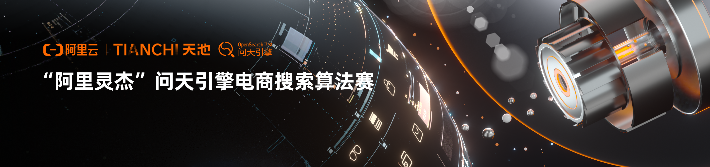

# 电商搜索召回



## 题目背景

电商搜索质量的高低将直接决定最终的成交结果。题目数据分两部分，一部分是 query，一部分是 title，10w 对 query-title  数据是有标注的，还有另外的 90w 无标注 title 数据。如果没办法下载比赛数据，阿里开源了[相似数据](https://github.com/Alibaba-NLP/Multi-CPR/tree/main/data/ecom)。数据格式如下：左侧是 query，右侧是 title。

```
游民部落电竞馆	游民部落技嘉M27Q27英寸KVM电竞显示器0.5ms170Hz快速液晶2K屏
甜味饼干	特产嘉士利甜薄脆芝麻味2kg饼干休闲零食品包邮
电推刨	木工刨床铁刨孢抛袍电刨子大孢子手提式修打磨机压刨爆木板手推刨
厨美奇	具灶炉单个单眼炉具天燃气节能灶煤气灶单灶猛火灶家用猛火节。
胖女孩大码显瘦套装	13胖女孩冬季一套衣服12-15岁初中学生女运动服14卫衣休闲裤套装
内径磨加工	定制钨钢拉伸模具硬质合金热锻缩口拉丝钻套冲棒模轴套粉末冶金件
隆鑫125发动机中箱壳	三轮摩托车隆鑫LX125/TK120发动机机壳120曲轴箱中箱箱体
中草药热喷机	冷热喷雾机美容仪中草药充电喷雾器冷喷蒸脸器蒸汽纳米离子美容院
```

- 初赛为召回阶段，生成 query 和 title 的表示。给定一个 query，后台在 100w 数据中召回最相近的 title，MRR@10 为评价指标。
- 复赛为排序阶段，假设 query 召回了 10 个候选 title，将 query 和 10 个 title 进行拼接得到一个句子，对这个拼接的句子进行打分，分数越高，排名越前，MRR@10 为评价指标。

因为之前接过图像检索的项目（也是召回出和查询图片最相似的图片），于是就决定参加了。但是丝毫不会 NLP，所以这次比赛变成了一个毫无 NLP 经验的人的比赛（挖坑填坑）之旅，保守估计最开始的一个月爆肝了 10 个版本左右的代码，跑过很多程序，看过很多论文和源码，完结撒花。关于程序：`main.py` 或 `run.sh` 为入口，路径肯定对不上，请自行 debug。

## 召回阶段

因为不知道如何去做，大部分时间都在查阅相关了论文，然后复现。所以代码和专业人士的代码比起来像个玩具。基础框架 baseline 得分：

1. 实现 DSSM baseline，直接优化距离结果很差，得分 0.057
2. 实现 CoSENT，余弦距离得分 0.159
3. 实现 SimCSE，得分 0.227

tools 里面是精度转换和结果文件检查。

## Trick

1. 在 model.py 中使用 first-last-avg 融合大概从 0.22 提升到 0.245 左右，调参好的话可以到 0.25。
    <details><summary>Details</summary>

    ```py
    def forward(self, input_ids, attention_mask, token_type_ids):
        out = self.extractor(input_ids,
                             attention_mask=attention_mask,
                             token_type_ids=token_type_ids,
                             output_hidden_states=True)

        first = out.hidden_states[1].transpose(1, 2)
        last = out.hidden_states[-1].transpose(1, 2)
        first_avg = torch.avg_pool1d(
            first, kernel_size=last.shape[-1]).squeeze(-1)  # [batch, 768]
        last_avg = torch.avg_pool1d(last, kernel_size=last.shape[-1]).squeeze(
            -1)  # [batch, 768]
        avg = torch.cat((first_avg.unsqueeze(1), last_avg.unsqueeze(1)),
                        dim=1)  # [batch, 2, 768]
        out = torch.avg_pool1d(avg.transpose(1, 2), kernel_size=2).squeeze(-1)
        x = self.fc(out)
        x = F.normalize(x, p=2, dim=-1)
        return x
     ```

    </details>


2. 在 `unilm` 文件夹下，进行 `UniLM` 预训练并微调。数据为 100w title 数据进行[随机截断](https://github.com/muyuuuu/E-commerce-Search-Recall/blob/main/unilm/utils_unilm.py#L268-L282)。大概 0.265 左右。预训练模型下载: [YunwenTechnology/Unilm](https://github.com/YunwenTechnology/Unilm)

3. 在 `simbert` 文件夹下，进行 `simbertv2` 预训练并微调，增加相似度任务和 bart 任务。并对 100w title 数据随机进行 0.3 截断模拟 query。得分 0.31 左右。预训练模型下载：[ZhuiyiTechnology/roformer-sim](https://github.com/ZhuiyiTechnology/roformer-sim)

以上是稳定提分的 trick，至于其他的学习率升温、模型结构、激活函数和超参等，有些也能提分，但不明显，这里就不细说了。我还尝试过其他的诸如：数据增强、transfer-mixup、label-smooth、am-softmax等技巧，以及复现了 [EASE: Entity-Aware Contrastive Learning of Sentence Embedding](https://github.com/studio-ousia/ease)、[Dense Passage Retrieval](https://github.com/facebookresearch/DPR)、 [Embedding-based Retrieval in Facebook Search](https://arxiv.org/abs/2006.11632) 等顶会论文，只能说不适用于本次场景。

## 排序阶段

在 `rank` 文件夹下，由于本人丝毫不懂 `tf1.x` 的代码，遂使用了官方的 baseline，没有什么太大修改。即使官方提供了 basline，能使用 `tf1.x` 并提交的人很少，如果官方不提供，怕不是复赛没人了。

如果要说想法，`pair-wise` 那些损失函数吧，肯定比单纯的 NSP 损失函数要好。

# 参考

- [CoSENT 实现](https://github.com/shawroad/CoSENT_Pytorch)
- [SimCSE 实现](https://github.com/zhengyanzhao1997/NLP-model/tree/main/model/model/Torch_model/SimCSE-Chinese)
- [UniLM](https://github.com/YunwenTechnology/Unilm)
- [SimBERTv2](https://github.com/ZhuiyiTechnology/roformer-sim)
- [tensorflow-simcse](https://github.com/jifei/simcse-tf2)

# 其他

我基于 LSH 算法自己实现了一个 ANN [检索工具](https://github.com/muyuuuu/high-performance-LSH)，使用本次赛题的数据在本地测试召回结果还行，欢迎 star。

# 致谢

- 本仓库中的工作得到西安电子科技大学高性能计算校级公共平台的支持. Supported by High-performance Computing Platform of XiDian University.
- 感谢我的[队友](https://github.com/xzhws)
- 感谢 [DunZhang](https://github.com/DunZhang) 提供的帮助
